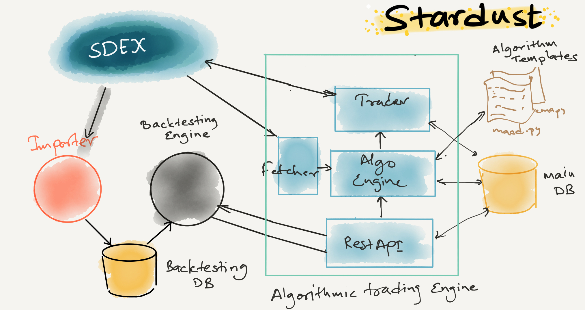

Stardust 
--------
A simple trading bot engine

#### Why Stardust
Stardust is a simple algorithmic trading framework. Its a framework and not a full-fledged website
or an app that can be directly used. It has an algorithmic trading engine and provides a set of APIs
to interact with this engine. This framework can be used to create the **trading bots** and other cool stuff.

#### What it can do
Stardust has the following components:
1. Algorithmic trading engine (trading bot engine)
2. Plugin-like mechanism to create the templates for the algorithm that a user can customize (trading bot algorithms)
3. REST API engine to interact with the engine
4. Historical SDEX data importer and a backtesting engine (to test bots performance with historical data)

Following is a high-level architecture diagram of the Stardust:


#### Work in progress
Stardust is still a work in progress and needs improvement in the following areas:
1. Multiuser authentication is not enabled (but has necessary hooks and database schema to enable multiuser usage)
2. Backtesting engine needs performance improvement (currently single threaded)
3. Documentation to explain how to customize the algorithms
4. Client implementation (currently only REST APIs are supported)


#### Installation
To install run the following commands:
```
#create virtualenv
virtualenv -p python3 venv
. venv/bin/activate
#install dependencies
pip install -r requirements.txt
#install stardust
python setup.py install
```

#### Configuration
All configuration is done in `engine.yaml` file.

Create the necessary tables in respective .db files in SQLite.
Refer `db.schema` file for DB creation DML queries.

#### Running
To run execute following command
```
# start data importer
importer.sh -c /path/of/engine.yaml
# start backtesting engine
backtester.sh -c /path/of/engine.yaml
# start trading engine
engine.sh -c /path/of/engine.yaml
```

#### Guides
Refer following documentation for interfacing and customizing the engine.
1. [Algorithm design guide](Algorithms.md)
2. [REST API Guide](RESTAPI.md)
